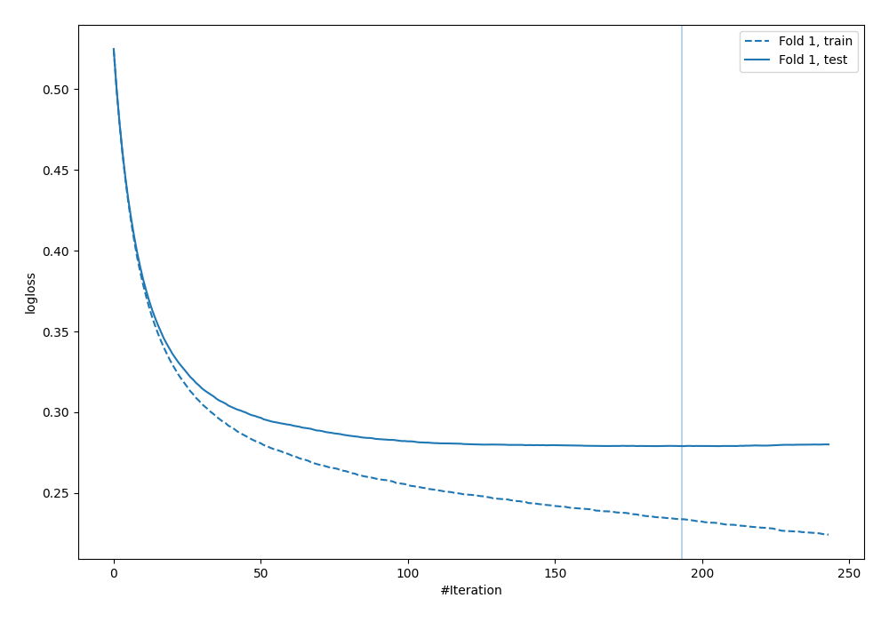
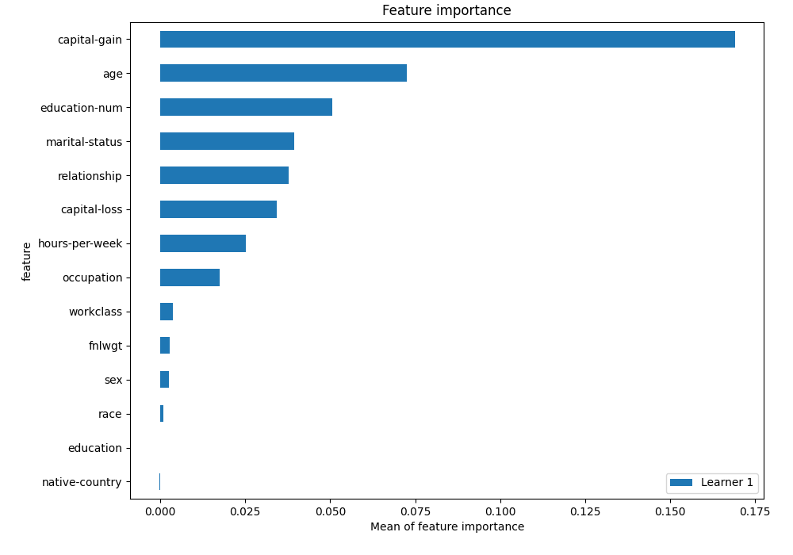
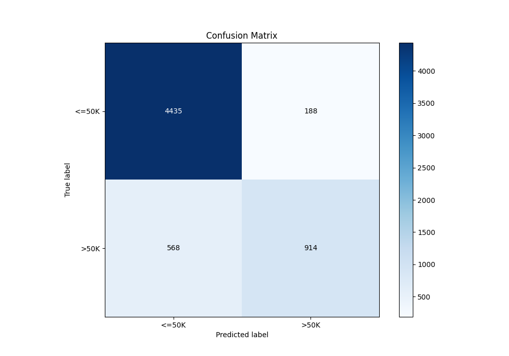
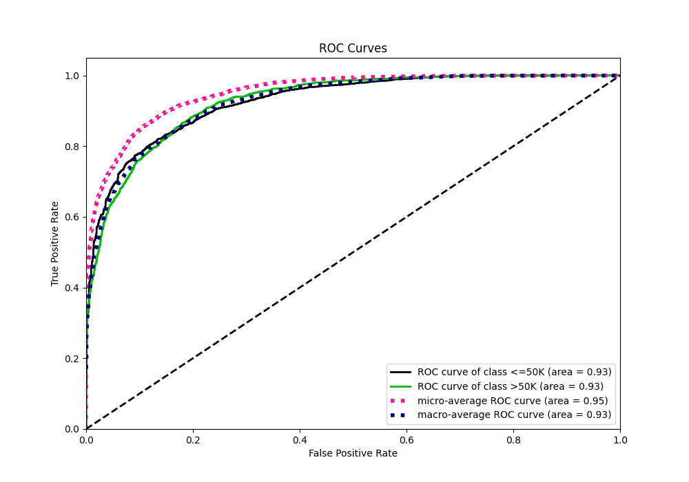
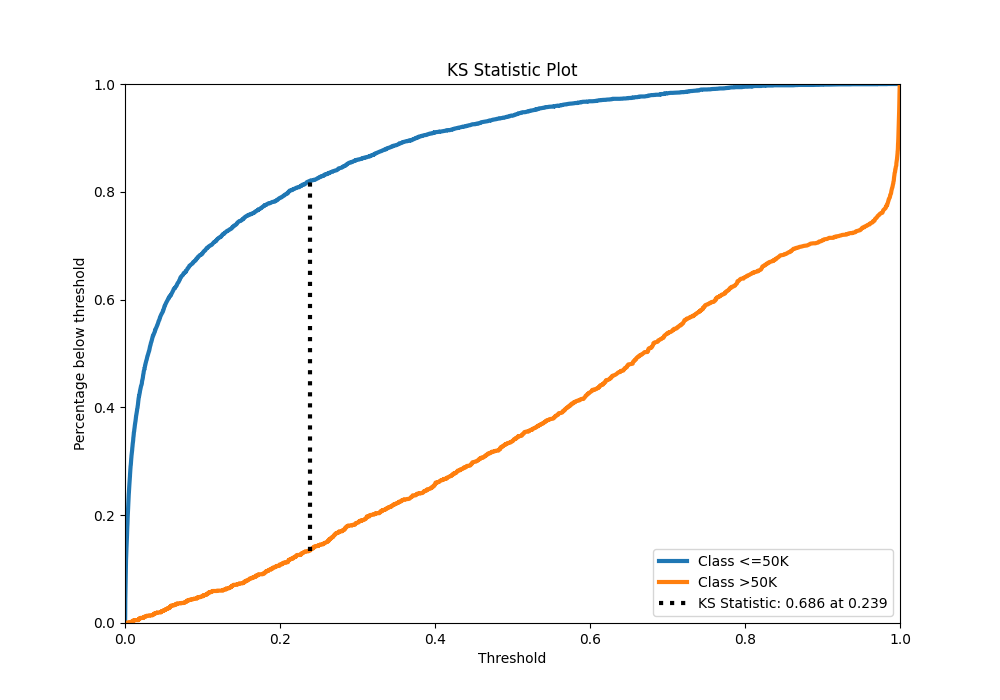
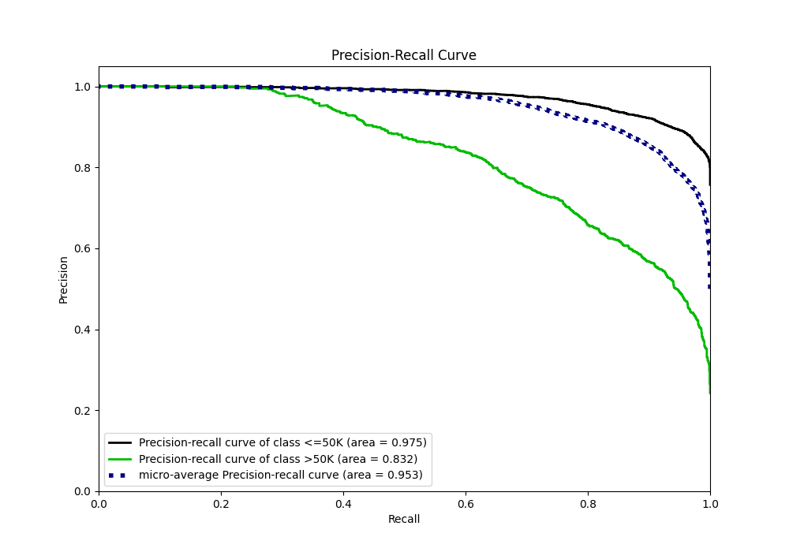
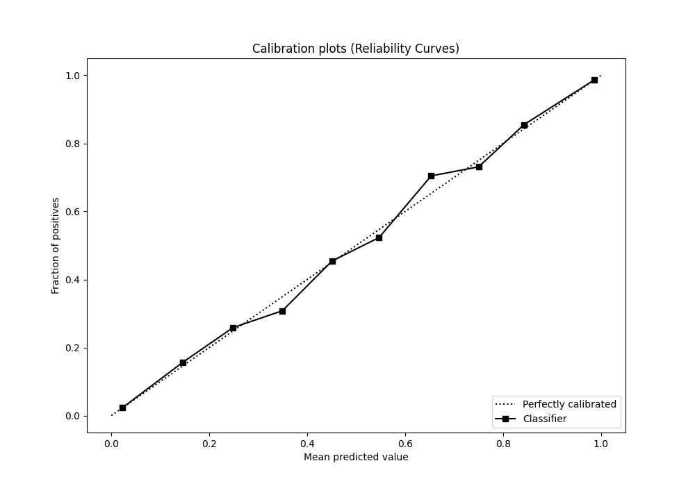
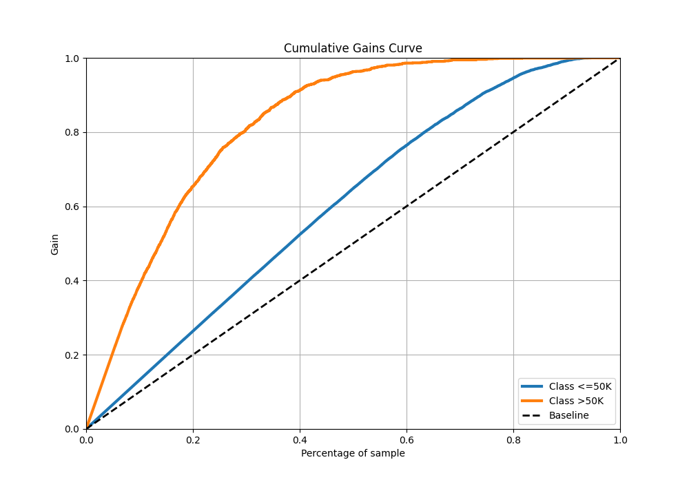
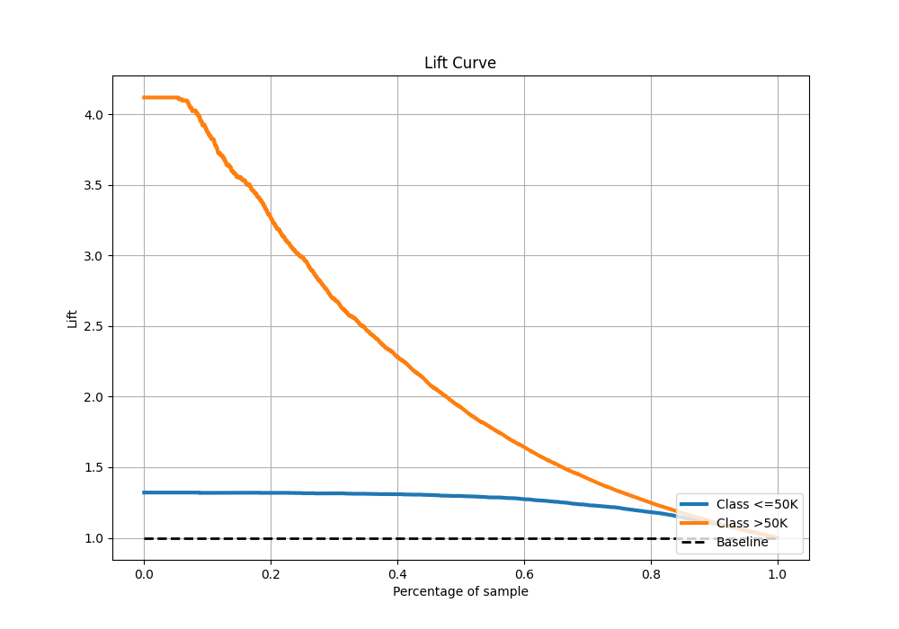

# Summary of 3_Default_Xgboost

[<< Go back](../README.md)

## Extreme Gradient Boosting (Xgboost)
- **n_jobs**: -1
- **objective**: binary:logistic
- **eta**: 0.075
- **max_depth**: 6
- **min_child_weight**: 1
- **subsample**: 1.0
- **colsample_bytree**: 1.0
- **eval_metric**: logloss
- **explain_level**: 2

## Validation
 - **validation_type**: split
 - **train_ratio**: 0.75
 - **shuffle**: True
 - **stratify**: True

## Optimized metric
logloss

## Training time

5.9 seconds

## Metric details
|           |    score |     threshold |
|:----------|---------:|--------------:|
| logloss   | 0.279008 | nan           |
| auc       | 0.92745  | nan           |
| f1        | 0.735304 |   0.397239    |
| accuracy  | 0.876167 |   0.555797    |
| precision | 1        |   0.987209    |
| recall    | 1        |   3.84281e-05 |
| mcc       | 0.648831 |   0.397239    |

## Metric details with threshold from accuracy metric
|           |    score |   threshold |
|:----------|---------:|------------:|
| logloss   | 0.279008 |  nan        |
| auc       | 0.92745  |  nan        |
| f1        | 0.70743  |    0.555797 |
| accuracy  | 0.876167 |    0.555797 |
| precision | 0.829401 |    0.555797 |
| recall    | 0.616734 |    0.555797 |
| mcc       | 0.642175 |    0.555797 |

## Confusion matrix (at threshold=0.555797)
|                  |   Predicted as <=50K |   Predicted as >50K |
|:-----------------|---------------------:|--------------------:|
| Labeled as <=50K |                 4435 |                 188 |
| Labeled as >50K  |                  568 |                 914 |

## Learning curves

## Permutation-based Importance

## Confusion Matrix

## Normalized Confusion Matrix

## ROC Curve

## Kolmogorov-Smirnov Statistic

## Precision-Recall Curve

## Calibration Curve

## Cumulative Gains Curve

## Lift Curve

[<< Go back](../README.md)
