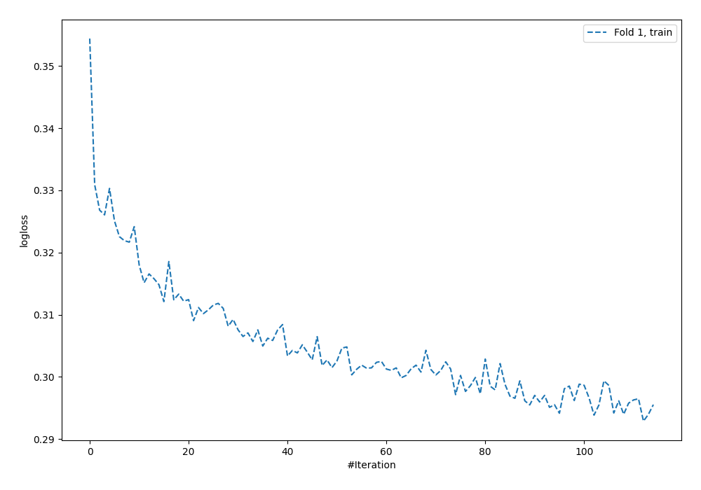
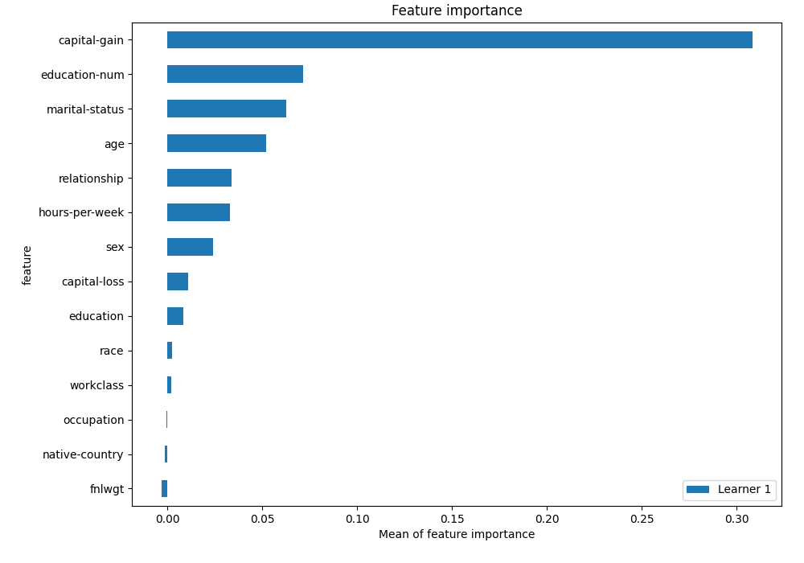
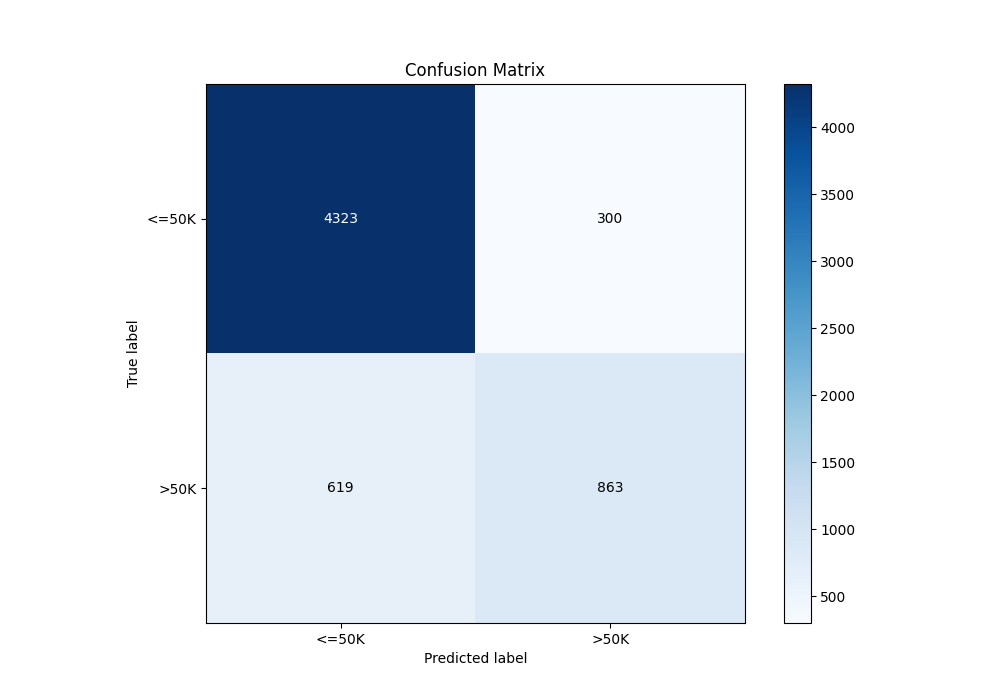
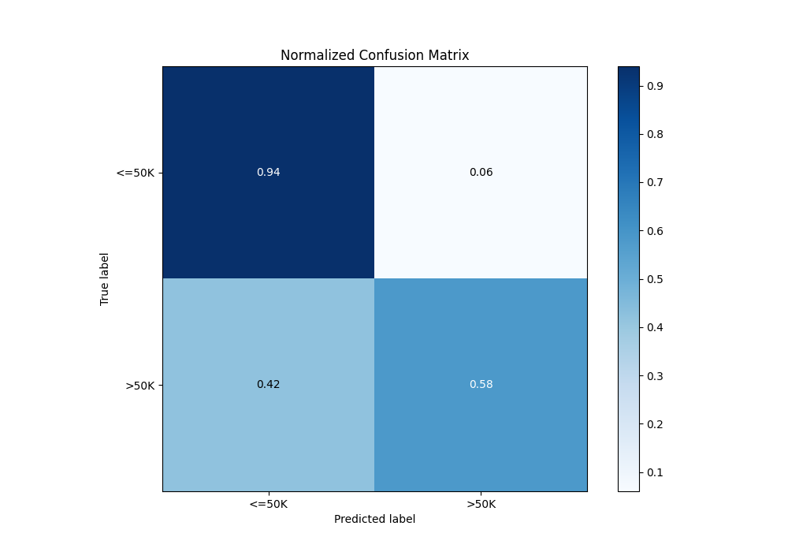
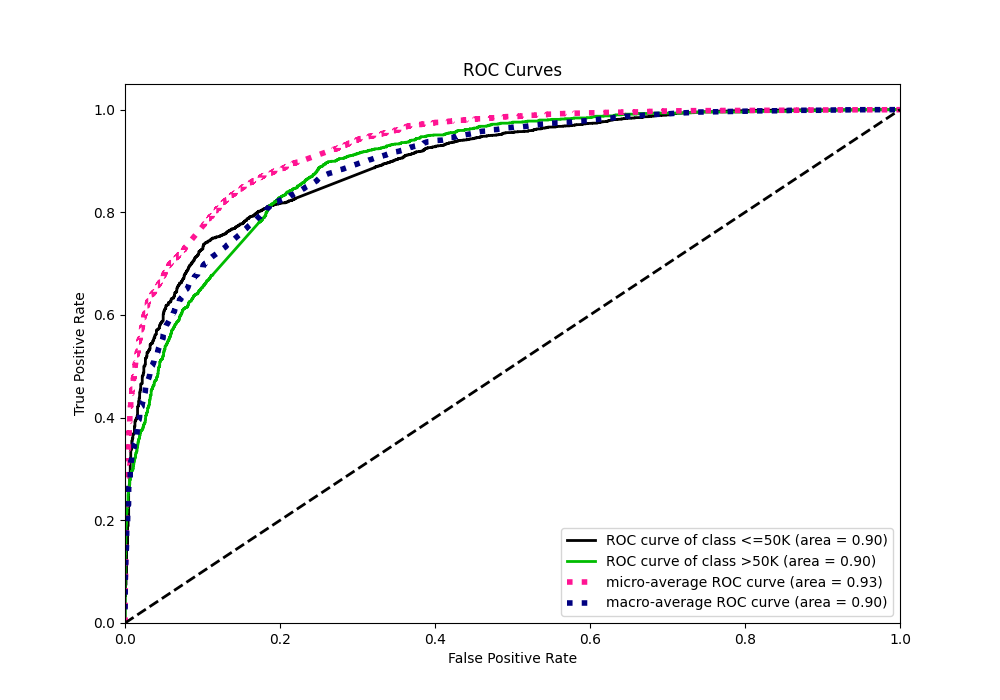
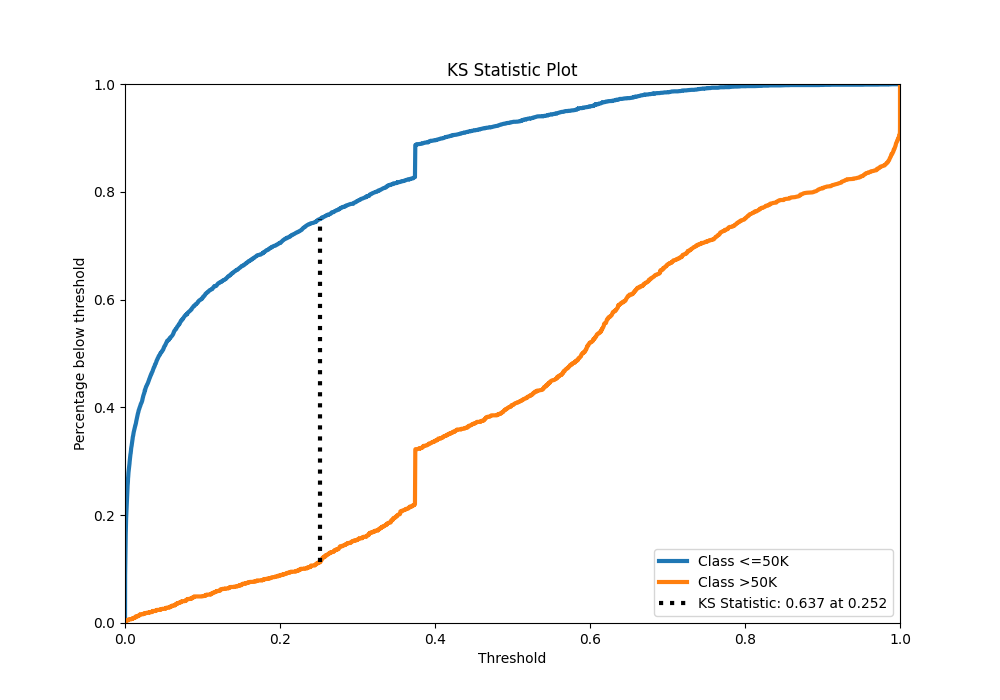
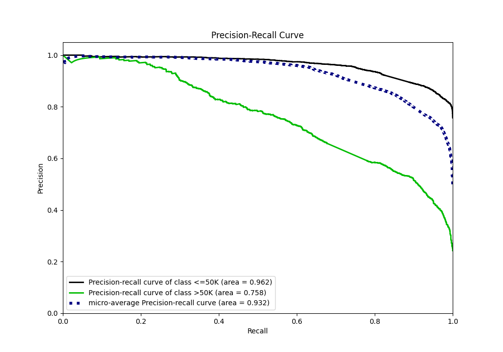
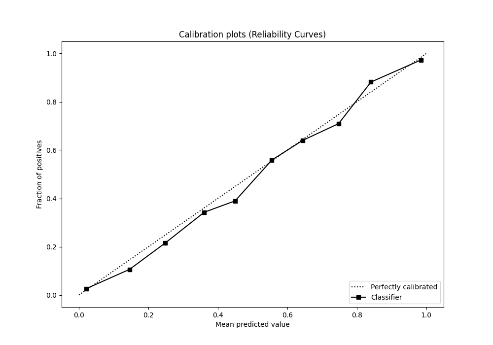
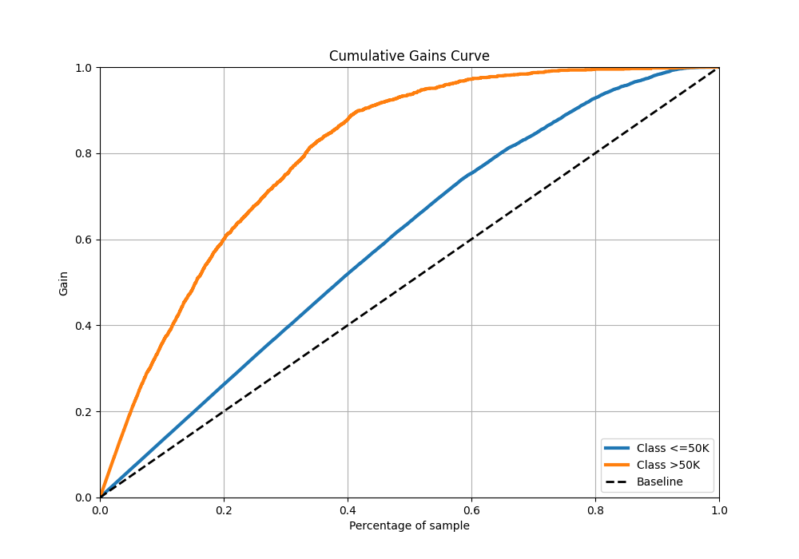
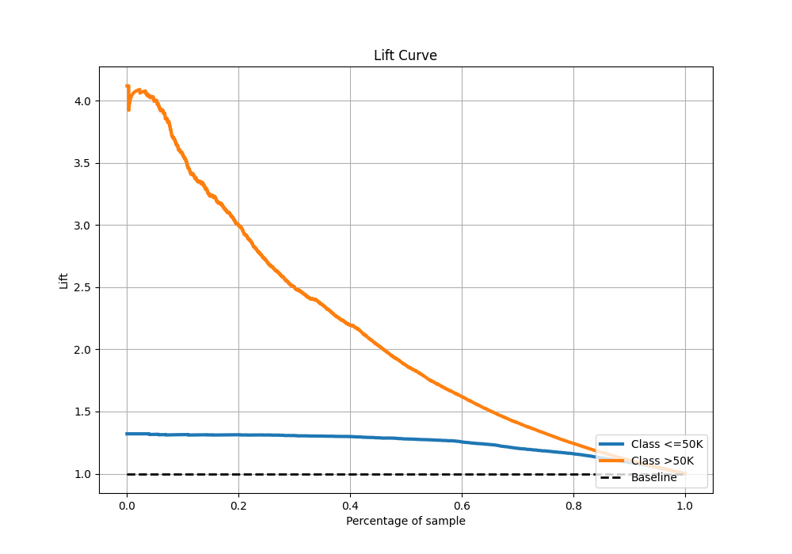

# Summary of 4_Default_NeuralNetwork

[<< Go back](../README.md)

## Neural Network
- **n_jobs**: -1
- **dense_1_size**: 32
- **dense_2_size**: 16
- **learning_rate**: 0.05
- **explain_level**: 2

## Validation
 - **validation_type**: split
 - **train_ratio**: 0.75
 - **shuffle**: True
 - **stratify**: True

## Optimized metric
logloss

## Training time

8.5 seconds

## Metric details
|           |    score |    threshold |
|:----------|---------:|-------------:|
| logloss   | 0.335524 | nan          |
| auc       | 0.897206 | nan          |
| f1        | 0.67809  |   0.339735   |
| accuracy  | 0.849468 |   0.518478   |
| precision | 0.992063 |   0.999966   |
| recall    | 1        |   1.9658e-09 |
| mcc       | 0.566462 |   0.339735   |

## Metric details with threshold from accuracy metric
|           |    score |   threshold |
|:----------|---------:|------------:|
| logloss   | 0.335524 |  nan        |
| auc       | 0.897206 |  nan        |
| f1        | 0.652552 |    0.518478 |
| accuracy  | 0.849468 |    0.518478 |
| precision | 0.742046 |    0.518478 |
| recall    | 0.582321 |    0.518478 |
| mcc       | 0.56493  |    0.518478 |

## Confusion matrix (at threshold=0.518478)
|                  |   Predicted as <=50K |   Predicted as >50K |
|:-----------------|---------------------:|--------------------:|
| Labeled as <=50K |                 4323 |                 300 |
| Labeled as >50K  |                  619 |                 863 |

## Learning curves

## Permutation-based Importance

## Confusion Matrix

## Normalized Confusion Matrix

## ROC Curve

## Kolmogorov-Smirnov Statistic

## Precision-Recall Curve

## Calibration Curve

## Cumulative Gains Curve

## Lift Curve

[<< Go back](../README.md)
