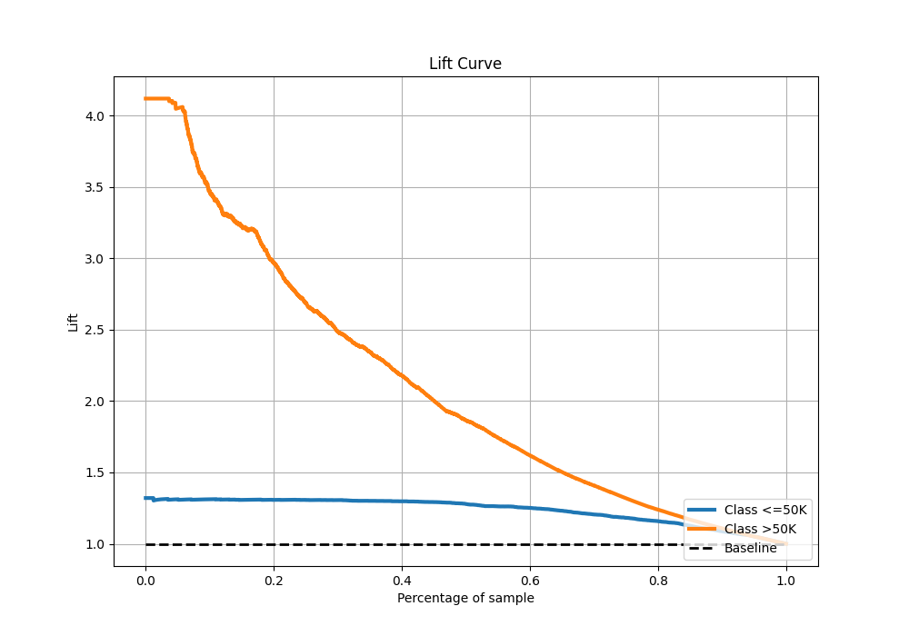

# Summary of 5_Default_RandomForest

[<< Go back](../README.md)

## Random Forest
- **n_jobs**: -1
- **criterion**: gini
- **max_features**: 0.9
- **min_samples_split**: 30
- **max_depth**: 4
- **eval_metric_name**: logloss
- **explain_level**: 2

## Validation
 - **validation_type**: split
 - **train_ratio**: 0.75
 - **shuffle**: True
 - **stratify**: True

## Optimized metric
logloss

## Training time

5.3 seconds

## Metric details
|           |    score |   threshold |
|:----------|---------:|------------:|
| logloss   | 0.341457 | nan         |
| auc       | 0.893226 | nan         |
| f1        | 0.671263 |   0.30097   |
| accuracy  | 0.851433 |   0.490349  |
| precision | 1        |   0.983235  |
| recall    | 1        |   0.0332749 |
| mcc       | 0.564094 |   0.490349  |

## Metric details with threshold from accuracy metric
|           |    score |   threshold |
|:----------|---------:|------------:|
| logloss   | 0.341457 |  nan        |
| auc       | 0.893226 |  nan        |
| f1        | 0.640507 |    0.490349 |
| accuracy  | 0.851433 |    0.490349 |
| precision | 0.776177 |    0.490349 |
| recall    | 0.545209 |    0.490349 |
| mcc       | 0.564094 |    0.490349 |

## Confusion matrix (at threshold=0.490349)
|                  |   Predicted as <=50K |   Predicted as >50K |
|:-----------------|---------------------:|--------------------:|
| Labeled as <=50K |                 4390 |                 233 |
| Labeled as >50K  |                  674 |                 808 |

## Learning curves

## Permutation-based Importance

## Confusion Matrix

## Normalized Confusion Matrix

## ROC Curve

## Kolmogorov-Smirnov Statistic

## Precision-Recall Curve

## Calibration Curve

## Cumulative Gains Curve

## Lift Curve

[<< Go back](../README.md)
